# Task App V1

A todo list app built with Spring Boot 3 and PostgreSQL.

## Getting Started

### Welcome

Welcome to the Task Application build!

I’ll guide you through the process of building the Task Tracker Spring Boot application, step by step.

I’ll even provide a React application frontend you can use to interact with the Spring Boot application, which you’ll find in the following lessons.

Have fun

Aaron

### Prereqs

To build the task app you’ll need a working knowledge of Java, Maven and Docker.

By “working knowledge” I mean that I won’t be explaining the use of these technologies in this project, so it’s assumed you already know how they work.

We’ll be using the Node Package Manager (npm) to install the dependencies for the frontend, so although you don’t need to know how Node works, or how to build a React application, it would be beneficial to know what Node is and what is means to use npm. Otherwise, a quick read of the Node website should be enough to understand this.

For Spring Boot, it’s enough to know the basic concepts. If you’ve taken a beginners course on Spring Boot then you should be good to go.

You don’t need to have actually built a Spring Boot app from scratch before as you’ll be able to follow along, step by step.

However as we will be focused on building, having a handle on the fundamental concepts will be key.

#### Summary

- You’ll need a basic knowledge of Java, Maven & Spring Boot

- We’ll be using npm to build and run the React frontend

- You don’t need to have built a Spring Boot app from scratch before

- We will be focused on building, rather than deep-diving concepts

### Development Environment Setup

#### Java

To build the task app you’re going to need Java 21 or later.

You can check your Java version by opening up a terminal or a command prompt and typing:

```bash
java -version
```

If you see an earlier version then I’d recommend heading over to oracle.com to download JDK 21 or later.

> [!CAUTION]
> This build uses JDK version 21. You may get different results if you use a different version.

Or if you prefer to use an open source JDK, then you can download it from Adoptium, which is a part of the Eclipse Foundation.

Either JDK should work for this project.

#### Maven

We’ll be using Apache Maven to manage our project, although you’ll not need to install this on your system as an instance of Maven will come bundled with your skeleton Spring Boot project, but more on that later.

#### Node

To run the frontend code I’ll provide, you’ll need Node version 20 or later.

You can check your Node version by opening up a terminal or a command prompt and typing:

```bash
node --version
```

Note it’s two dashes before “version” for node, but only one for Java.

If you don’t have the required version then head over to nodejs.org to download a later version of node.

#### Docker

To run the PostgreSQL database we’ll be using later, you’ll need docker installed on your machine.

To check you have docker installed, open up a terminal or command prompt and type:

```shell
docker --version
```

You get a version number printed out, otherwise head over to docker.com to download docker.

#### IDE

I’m going to be using the community version of IntelliJ IDEA as the IDE for this project.

You can use any IDE you like, such as Visual Studio Code, but I recommend IntelliJ as it’s brilliant for Java development.

You can download IntelliJ for free from the JetBrains website.

#### Summary

- You’ll need JDK 21 or later.

- We’ll be using Maven, but you don’t need to install this.

- You’ll need Node V20 or later to run the frontend.

- You’ll need Docker installed in order to easily run PostgreSQL.

- You’ll need an IDE, I recommend IntelliJ IDEA.

## What We Build

### Project Brief Overview

In any real-world software development project there will be a set of requirements which describe what the system should do in order for it to be considered a success.

Let's review the requirements for the Task Tracking application we are to build.

#### The Project Brief

The Task Tracker App is designed to help users organize their daily tasks, set priorities, and track their progress.

This application will provide a user-friendly way for creating, managing, and completing tasks, helping users to increase their productivity and stay organized.

##### Definitions

###### Task

A task is a specific action item or to-do that a user wants to complete. It typically includes a title, description, due date, and priority level.

###### Task List

A task list is a collection of related tasks, grouped together for organizational purposes (e.g., "Work Tasks", "Personal Errands", "Project X").

##### User Stories

###### Group Tasks into Task Lists

As a project manager

I want to be able to create multiple task lists for different projects

So that I can keep tasks organized and separate
Acceptance Criteria

1. A user can create task lists which can contain tasks.

2. Each task list should have a title and optional description.

###### Update Task Lists

As a project manager

I want to be able to update a task list’s name

So that I can ensure task lists names remain relevant

**Acceptance Criteria**

1. A user can update task lists name and description.

###### Delete Task Lists

As a project manager

I want to be able to delete task lists I no longer need, or have created by mistake

So that I can ensure task lists remain relevant

**Acceptance Criteria**

1. A user can delete task lists.

###### Capture Tasks

As a busy professional

I want to be able to quickly add new tasks to my list

So that I can capture all my responsibilities without losing focus on my current work

**Acceptance Criteria**

1. Users can create new tasks on a task list.

2. Each task should have a title, optional description, due date, and priority level.

###### Update Tasks

As a user with a busy schedule

I want to be able to adjust the title, description, due date and priority level of my tasks

So that I can focus on what's most important

**Acceptance Criteria**

1. Users should be able to edit tasks.

###### Delete Tasks

As a user prone to making mistakes

I want to be able to delete tasks I have created by mistake

So that my task list of tasks is correct

**Acceptance Criteria**

1. Users should be able to delete tasks.

###### Complete Tasks

As a productive user

I want to be able to mark tasks as complete

So that I know which tasks I have completed and can focus on the next task I need to complete

**Acceptance Criteria**

1. Users should be able to mark tasks as complete.

###### Task Completion Progress

As a productive user

I want to be able to see my task list’s task completion progress

So that I can stay motivated and understand my productivity

**Acceptance Criteria**

1. Users are informed of their completion percentage of tasks in a task list

##### Bonus Features

- Users can set reminders for important tasks.
- The app should provide a way to filter and sort tasks based on due date, priority, or list.
- The app should provide a dashboard showing task completion statistics.
- Users can search for tasks across all their lists.
- Implement a tagging system for tasks to allow for more flexible organization.
- Add the ability to share lists or individual tasks with other users.
- Integrate with calendar applications to sync due dates and reminders.
- Implement a Pomodoro timer feature to help users focus on tasks.
- Create a gamification system with points and achievements to encourage consistent app usage.

#### Project Brief Analysis

The project brief itself is broken down into a few different sections.

##### Summary

The first is a brief summary of the project – that it is an app "designed to help users organize their daily tasks, set priorities, and track their progress".

##### Definitions

Next there are some definitions. They're captured here to make sure that we're all using the same words to mean the same things.

Here we have a definition of a Task as a "specific action item or to-do that a user wants to complete. It typically includes a title, description, due date, and priority level". This is great as it tells us the sort of members our Task class might have, but more on that later.

Then we have a definition for a Task List, which is a list of tasks, simple enough. But the description tells us that a Task List has a name member – a useful piece of information when we come to implement it.

##### User Stories

Next we have a list of user stories. If you're unfamiliar with this pattern, a user story describes what a user wants to do from the point of view of that user.

This little nuance is enough to give us some additional context, over “the system MUST do X”. More context helps us make better decisions during development.

Each user story follows the format as a, I want, so that. In the first case:

> **As a** project manager
> **I want** to be able to create multiple task lists for different projects
> **So that** I can keep tasks organized and separate

We can see from this little story that there's a requirement of a user being able to create multiple task lists.

##### Acceptance Criteria

Following each user story we have a set of acceptance criteria.

Acceptance criteria are statements which can evaluate to true or false.

The idea is, when all acceptance criteria evaluate to true, then the user story is considered complete and finished.

For this user story we can see the following acceptance criteria:

- A user can create task lists which can contain tasks.
- Each task list should have a title and optional description.

Our implementation would need to work in such a way to make both statements true.

#### Summary

- We'll build a task tracking app
- The application uses Task Lists to group related tasks together
- Requirements are defined through user stories and acceptance criteria
- Additional bonus features are available for further practice

### Domain Overview

A fundamental step in any object oriented programming project is to define the objects, or domain, that we’ll be working with.

In this case we only have the project brief to work from, but it happens to include everything we need.

#### Analyzing the Brief for the Domain

A simple, but incredibly effective way to identify the domain is to go through the available documentation and identify the nouns – the things. They then become our objects and their instance variables.

If we look at the brief we see two words popping up a lot, and that’s “Task” and “Task List”, where the relationship between Task List and Task is “contains” – that’s to say that a Task List contains Tasks.

If we dig a little further we can see that a Task List should have a name or a title – some way of identifying it, and it can have an optional description as well.

A task also has a title and a description, but it also has a due date – the date and time the task should be completed by.

A task should also be able to be complete, so it would make sense for the Task object to have some kind of status associated with it.

Finally, there’s talk of a task having a priority, which I assume to be high, medium, and low.

#### Domain Model Diagram

With this information identified, we now need some way of capturing it, so let’s create a Domain Model Diagram, which captures the core concepts and relationships between them.

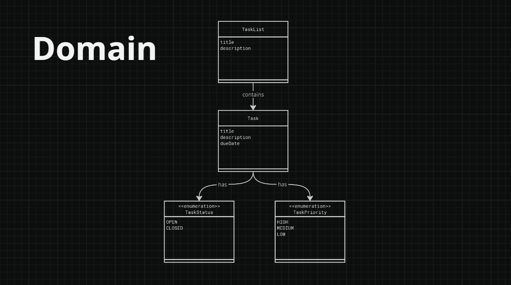

In this diagram you can see I’ve captured the TaskList and Task objects, their “contains” relationship, and the instance variables that we identified from our analysis.

What’s new here is that I’ve decided to represent a task’s status and priority as enums, which are TaskStatus having the values of OPEN and CLOSED, and the TaskPriority HIGH, MEDIUM and LOW.

I’ve shown the relationship between Task to TaskStatus, and Task to TaskPriority as having a “has” relationship. That’s to say that a Task has a status and a Task has a priority.

This is a great evolution from picking out some words on a page, but it’s missing some information, such as types, and the additional instance variables we would need to make a working system.

So let’s evolve this further into a Class Diagram.

#### Class Diagram

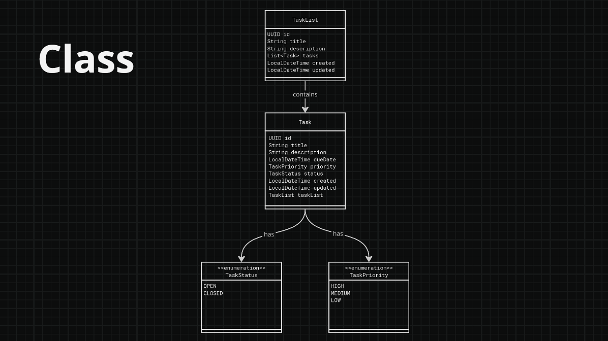

This diagram shows the classes we are to implement for our domain. You can see it includes additional instance variables such as id, created and updated, which are needed to identify our objects and give us admin information, such as when it was created and last updated.

We can also see that all instance variables have a type associated with them. I’ve elected to use UUIDs for ids rather than use an ascending numeric sequence in the database – both would work, but UUIDs tend to be easier to scale.

I’ve also included the instance variables which implement the relationships between our classes, for example you can see priority and status instance variables in the Task class.

If you’ve been taught the Domain Driven Design approach, you might be wondering why I’ve chosen not to model each class’s methods in this diagram. Perhaps our Task class should have a close method to move it from open to closed status?

It should be noted that each class will have getter and setter methods, and they are omitted from this diagram as they would simply clutter it up and perhaps confuse matters. However, as is typical in a Spring Framework application, we will not place our business logic into our domain classes, but instead into service classes, but more on those later.

#### Entity Relationship Diagram

Finally, for completeness, let’s include an Entity Relationship Diagram. This diagram shows how our domain, or “entities”, are organized and related in a relational database.

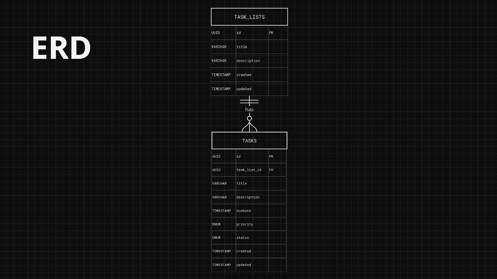

We can see a potential database table implementation, along with the many-to-one relationship between Task and TaskList. A TaskList will have many Tasks, a Task will belong to one TaskList.

Although we could implement this in a nosql database, given the clear relationship, we will use a relational database for this project.

Now that we understand the domain we will be working with, let’s explore what the user interface of such an application might look like.

#### Summary

- The domain consists of two main objects: `Task` and `TaskList` with a "contains" relationship
- `Task`'s have a many-to-one relationship with `TaskList`s
- The domain will be implemented using a relational database business logic will be placed in service classes rather than domain objects

### UI Overview

Now let’s explore the user interface.

As this project is focused on building the Spring Boot backend, we’ll not be going into the user interface design flow. Instead we can jump right to the actual user interface, as I provide this for you.

The user interface is an MVP, or minimum viable product. There are countless ways it can be improved, that said it does meet the requirements on the project brief.

Once we’ve started the frontend we’ll see the Task Lists Screen.

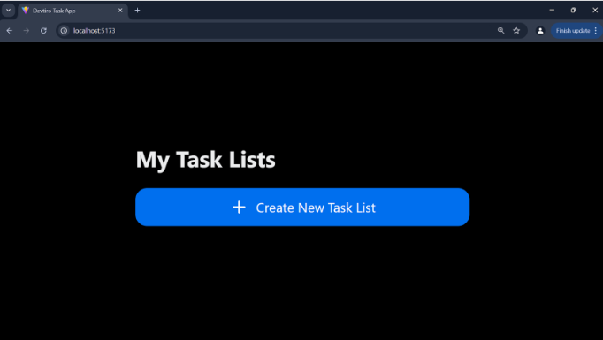

Clicking on the “Create New Task List” button gives us a simple form to create a new task list. Here we can specify the task list’s title and optional description.

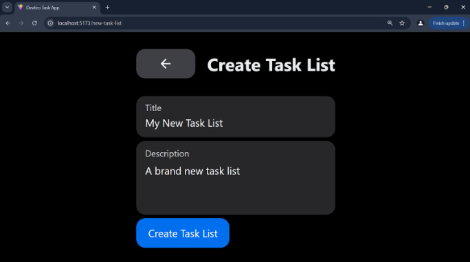

On filling in the form and clicking “Create Task List”, we are redirected to back to the Task Lists screen, but this time with a our new Task List showing:

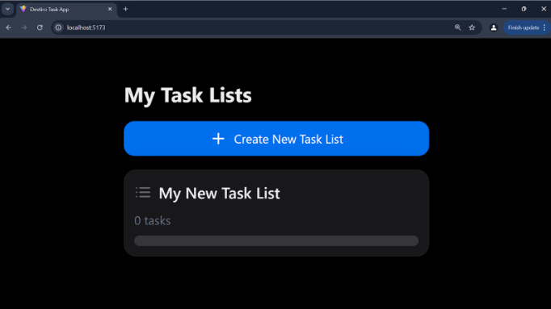

Clicking on the new task list will show us the Tasks screen, albeit with no tasks showing:

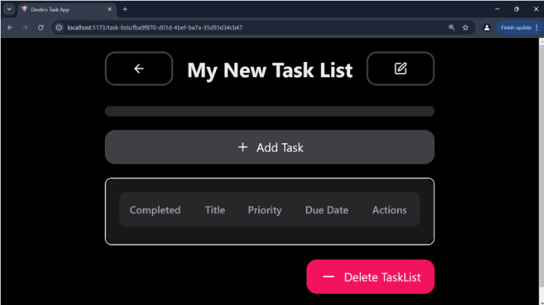

If we click the “Delete Task List” button in the bottom right, this will unceremoniously delete the task list.

If we click the button in the top right, we are shown the edit Task List screen, which allows us to update an existing task list:

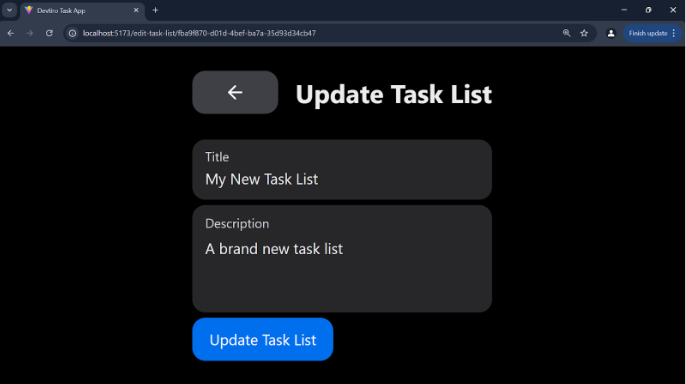

Clicking the “Add Task” button will present us with a form to create a new task on our task list:

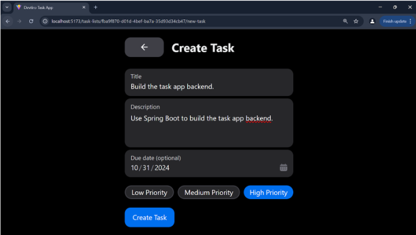

Once complete, clicking on “Create Task” will redirect us back to the task list page, but this time with a task showing:

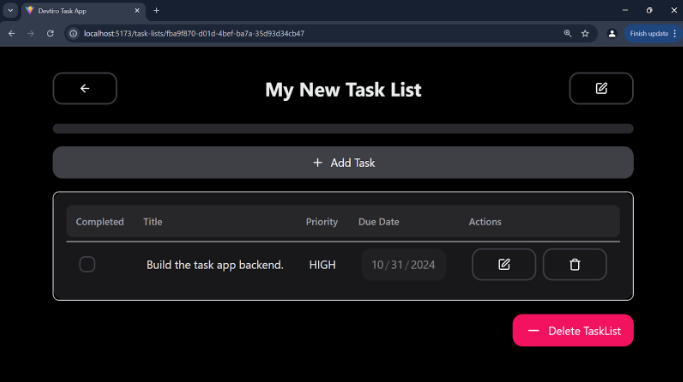

It is here that we can click the edit button next to the task to edit it, or the delete button to delete it.

Or, if we have complete the task, we can click the checkbox next to it:

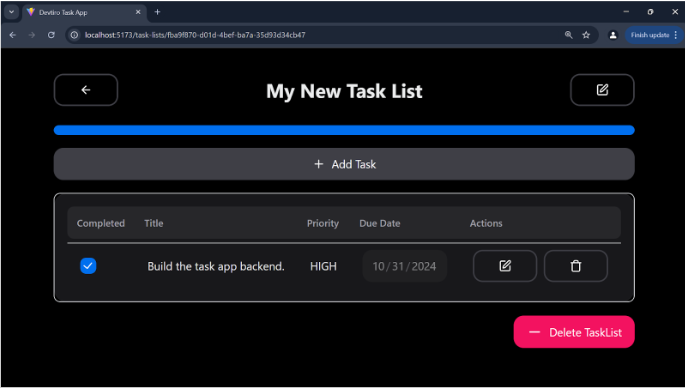

With that we can see the progress bar at the top fill up to represent all tasks in this task list being complete.

This is also true of the task lists screen too:

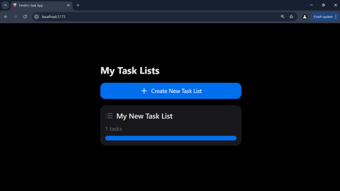

So although the UI could use some additional features, like data validation for a start, it appears to meet the requirements as set out, let’s shoot through the acceptance criteria and check:

1.  A user can create task lists which can contain tasks.

2.  Each task list should have a title and optional description.

3.  A user can update task lists name and description.

4.  A user can delete task lists.

5.  Users can create new tasks on a task list.

6.  Each task should have a title, optional description, due date, and priority level.

7.  Users should be able to edit tasks.

8.  Users should be able to delete tasks.

9.  Users should be able to mark tasks as complete.

10. Users are informed of their completion percentage of tasks in a task list

Looks like all statements are true for the app with this UI, of course, this UI was using a completed version of the backend which we are to build, so let’s next cover the project’s architecture.

#### Summary

- The user interface has multiple screens to manage task lists and tasks
- It meets the acceptance criteria
- It's a minimal viable product – you will be able to break it

### Architecture Overview

Let’s explore what the architecture of our application is to look like.

We’ll keep this simple and just stick to the components and how they fit together, rather than start describing how it may look once deployed to a production environment.

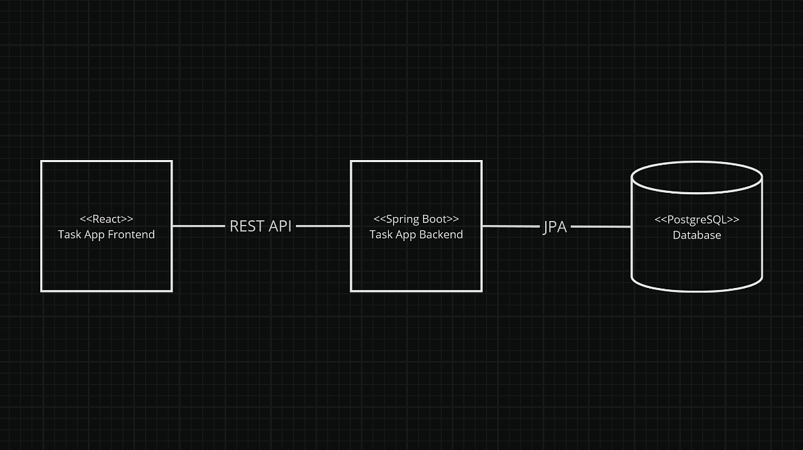

The application we’re to build has three main components.

There’s the database component, which we’ll be using PostgreSQL. We’ll run this in Docker to make things easy.

Then there’s our backend component. This is the Spring Boot application we are to build.

Then there’s the frontend component, which is a React application that I provide for you. Of course, feel free to build your own if you so choose, there’s nothing to say that you need to use my one.

Although not standard UML, I’ve indicated that we’ll use JPA in our Spring Boot application as the means to communicate with the database.

The frontend component will communicate with the backend through a REST API.

The REST API represents the interface between the frontend and backend, and considering we’ve already got a frontend to work with, it’s important that we implement the correct endpoints.

#### Summary

- The app has a React frontend, Spring Boot backend and Postgres database component
- The frontend interacts with the backend via a REST API
- The backend interacts with the database using JPA

### Rest Api Overview

If we start with the Tasks lists page, we will need a way of getting a list of all task-lists and a way  create task lists:

```text
GET       /task-lists    List Task Lists
POST      /task-lists    Create Task Lists
```

On the Task List Page, we’ll need a way to edit a task list and delete a task list. Also, because of page refreshes and the like, it would also be beneficial to to get the details of one task list by using it’s ID:

```text
GET     /task-lists/{task_list_id}    Get Task List by ID
PUT     /task-lists/{task_list_id}    Update Task list 
DELETE  /task-lists/{task_list_id}    Delete Task List
```

Moving onto Tasks, the task list page will need a way of listing all tasks for a task list and creating a task:

```text
GET       /task-lists/{task_list_id}/tasks  List Tasks
POST      /task-lists/{task_list_id}/tasks  Create Task
```

Once we have created a task we would need a way to edit the task and delete the task:

```text
GET     /task-lists/{task_list_id}/tasks/{task_id}    Get Task by ID
PUT     /task-lists/{task_list_id}/tasks/{task_id}    Update Task
DELETE  /task-lists/{task_list_id}/tasks/{task_id}    Delete Task
```

As tasks have a “has a” relationship with tasks and cannot exist without being associated with a task list, we use a URL structure for tasks which also specifies the task list ID.

So, at least initially, we can fulfill the requirements of the project by implementing the following endpoints:

```text
GET     /task-lists                                   List Task Lists
POST    /task-lists                                   Create Task Lists
GET     /task-lists/{task_list_id}                    Get Task List by ID
PUT     /task-lists/{task_list_id}                    Update Task list 
DELETE  /task-lists/{task_list_id}                    Delete Task List

GET     /task-lists/{task_list_id}/tasks              List Tasks
POST    /task-lists/{task_list_id}/tasks              Create Task
GET     /task-lists/{task_list_id}/tasks/{task_id}    Get Task by ID
PUT     /task-lists/{task_list_id}/tasks/{task_id}    Update Task
DELETE  /task-lists/{task_list_id}/task/{task_id}     Delete Task
```

#### Summary

- The REST API offers create, read, update and delete (CRUD) operations for `Task` and `TaskList`
- The `Task` URL path includes the `TaskList` URL path, representing their "has a" relationship

## Project Setup

### New Project

Let’s set up a new Spring Boot project.

By far the easiest way to do this is to use the Spring Initialzr, so let’s head over to start.spring.io in our browser.

Here is where we’ll specify the configuration we want our project to use, and download a skeleton project using that configuration which we can use to build the task app.

We’ll be using Maven as the build tool for this project, so we’ll make sure Maven is selected.

We’ll also be using Java, so we’ll select that too.

For the version of Spring Boot, we’ll use the latest general release version – that’s the highest version that doesn’t have a SNAPSHOT, RC, M, or any other set of letters after it.

At the moment this is 3.3.5, but it may be a later version by the time you visit the initialzr. Although I can’t guarantee it of course, the approach is very, _very_ likely to be the same.

The project metadata is largely just for identifying the app, I’m going to use `com.devtiro` for the group and tasks for the artifact – you’re welcome to use different values here.

That said we should select jar rather than war, as we don’t want to deploy this application to a separate application container, we’d rather that be bundled into the Jar.

For the Java version I’m going to select 21 at the latest long term support (LTS) release version. Again, you’re welcome to select a different version, but there may be some tweaks you need to make to the project.

For dependencies we’ll select Spring Data JPA and PostgreSQL, so we can interact with our database using Java objects.

We’ll also select H2 so we can use this in-memory database in our tests.

We’ll also select Web as we’ll be building a REST API. In theory, we could select Reactive Web instead. This would allow us to use the reactive programming model to potentially get more throughput and lower resource consumption, but at the risk of a steeper learning curve and complex app.

Furthermore, I don’t think a task app is going to be in dire need of more throughput, so let’s use the traditional web package for this project.

#### Summary

- Used Spring Initialzr (start.spring.io) to create a new Spring Boot project

- Selected key project configurations

- Added required dependencies

- Chose traditional web package over reactive for simplicity and learning purposes

### Project Structure

Let’s take a fresh look at this project.

If you’re unfamiliar with Maven, it’s worth pointing out that most of this project structure is defined by Maven and not Spring Boot.

We have a Maven pom.xml file in the root of our project – we’ll look at its contents in a moment.

You’ll also notice other files with mvn in name, `mvnw`, `mvnw.cmd` and the `.mvn` directory.

Together, this is a bundled instance of maven that we can use to build our project. If we open up a terminal on a \*nix and type:

```shell
mvnw install
```

Or on windows:

```bash
./mvnw install
```

We’ll be using this "maven wrapper" to build your project.

If we look in our pom.xml file, we can see a parent node for `spring-boot-starter-parent` with version 3.3.5 – the version of Spring Boot we selected in the Initialzr.

Next we see the project metadata we set in the project.

We see Java 21 – the Java version we specified in the Initialzr.

Finally we see the dependencies we selected, including  `spring-boot-starter-data-jpa`, `spring-boot-starter-data-web`, `h2`, `postgresql` and then the `spring-boot-starter-test`.

As we’ll only be using H2 to provide a database in any tests – completing the application context, I’m going to change the scope of this dependency from runtime to test.

Digging further into the application we have the `src/main/java` and `src/main/resources` – this structure is typical of a Maven project.

In the Java directory we have packages which represent those we specified in the Initialzr and a single `TaskApplication` class.

If we look in the resources directory we see application.properties which we can use to configure our Spring Boot application – at the moment it just contains a single property which specifies the name of the application.

Inside of `TasksApplication` we have a main method – the entrypoint of our application and we can see the class is annotated with `@SpringBootApplication` – marking this as a Spring Boot application and doing all the necessary work to make it that way.

Clicking the green triangle next to the main class or method will run the application – which we can see fails to start as it cannot connect to a PostgreSQL database.

#### Summary

- Maven-based project structure with wrapper (`mvnw`) and `pom.xml` configuration
- Key dependencies: Spring Boot 3.3.5, JPA, Web, PostgreSQL, H2 (test)
- Standard Maven directories with Spring Boot application class
- Application currently fails due to missing database connection

### Run Postgresql

Perhaps the easiest way to run PostgreSQL is to do so in Docker.

#### Make Sure Docker is Running

We’ve made sure Docker is installed, now let’s make sure it’s running. We can do this by opening a terminal or command prompt and running the following:

```bash
docker ps
```

If we see an empty list of running containers then we’re good to go. Otherwise you may need to launch Docker, which you can often do from start menus and application directories.

#### Create a Docker Compose File

Next we create a Docker compose file which runs PostgreSQL.

We use Docker Compose rather than Docker directly, as it allows us to specify an environment of one or more containers, all in yaml.

Not only is being able to manage our entire environment in one configuration file easier than using disparate Docker commands to set things up, you can check it into source control as well so it’s replicable across different developer’s machines.

We’ll create a file named `docker-compose.yml` in the root of our project with the following contents:

```yaml
services:
  # Our PostgreSQL database
  db:
    # The Docker image of postgres -- we're using the latest.
    image: postgres:latest
    # The ports to expose to the host container
    # 5432 is the default PostgreSQL port
    ports:
      - "5432:5432"
    # If we accidentally kill the running container, Docker Compose
    # will restart it.
    restart: always
    # The PostgreSQL Docker container uses environment variables to
    # read configuration, here we set the password.
    # ⚠️ - Do no store plaintext passwords in source control. We
    #      do so here as this is a builder.
    environment:
      POSTGRES_PASSWORD: changemeinprod!
```

#### Understanding the Docker Compose File

Looking over the `docker-compose.yml` file, we can see a service, which specifies an instance of the docker image `postgres:latest` should run, exposing port `5432` (the default PostgreSQL port) for us to connect.

We can also see an environment variable `POSTGRES_PASSWORD` specified. This is how we tell the Docker container the password for the `postgres` user.

Note that we’re not specifying any Docker volumes here – this means that if we restart our Docker environment then we will lose data in the database. Obviously not desirable in a production environment, but quite handy in a development environment.

#### Running Docker Compose

Now we can run our Docker Compose environment.

To do this, we’ll open a terminal or command prompt and navigate to the directory where the `docker-compose.yml` file is located.

Then we run:

```shell
docker-compose up
```

At this point Docker will download the `postgres:latest` docker image, if you don’t have it locally, and then run it ready to connect on port `5432`, ready to connect to from our Task app backend.

#### Summary

- Docker and Docker Compose are used to run PostgreSQL

- Running `docker-compose up` launches the PostgreSQL container

- The database is accessible on localhost:5432

- The container can be checked using `docker ps` command

### Connect To Postgres

When we tried to start our Spring Boot application earlier, we found that it failed to start. The reason for this being that we added PostgreSQL dependencies to our project, and the Spring Boot autoconfiguration has seen them and went about creating the necessary configuration to use a PostgreSQL data source.

That said, our app currently has no way of knowing about things like the password we’ve set in our `docker-compose.yml` file, so let’s fix this.

In the `src/main/resources` directory, we have our `application.properties` file – this is where we’ll set this information.

We’ll add the following to our properties file:

```properties
spring.datasource.driver-class-name=org.postgresql.Driver
spring.datasource.url=jdbc:postgresql://localhost:5432/postgres
spring.datasource.username=postgres
spring.datasource.password=changemeinprod!
```

These properties tell Spring that we’ll connect to a PostgreSQL database – it’s worked this much out for itself, but we’ll be explicit here, along with the rest of the configuration.

We tell our app where to find the database, namely on localhost running on port `5432`. We also specify to connect to the `postgres` database.

Then we specify the username of `postgres` and the same password that we specified in our `docker-compose.yaml` file.

This configuration is enough to connect to the database, but there is a missing piece of the puzzle – how are we to set the database schema up once we’re connected? Do we create all the necessary tables, indexes and sequences manually? That could get tedious, so let’s add one more line to our properties file:

```properties
spring.jpa.hibernate.ddl-auto=update
```

This line will cause our app to automatically set up, and even update the database schema to match the JPA entities we’ll create for our project – but more on those later.

Whilst we’re here, I mentioned that we’ll not be using PostgreSQL for our tests, of which we only have a single one – we’ll not be writing tests for this application as we’re focused on building, however we still want that test we have to pass.

So let’s correctly configure our test to use the H2 in-memory database. Let’s create a resources directory in `src/test` and in there an `application.properties` with the following content:

```properties
spring.datasource.driver-class-name=org.h2.Driver
spring.datasource.url=jdbc:h2:mem:testdb;DB_CLOSE_DELAY=-1
spring.datasource.username=sa
spring.datasource.password=sa
spring.jpa.hibernate.ddl-auto=create-drop
spring.jpa.database-platform=org.hibernate.dialect.H2Dialect
```

This configuration will be used by tests to connect to the H2 in-memory database, and not the Postgres one.

#### Summary

- Spring Boot requires database configuration properties to connect to PostgreSQL

- Configuration is added in `src/main/resources/application.properties`

- Test configuration in `src/test/resources/application.properties`

- Spring Boot can now connect and manage the PostgreSQL database

- Run tests using H2 instead of PostgreSQL

### Run The Frontend

Once we have the code locally, we open up a terminal or command prompt and navigate to directory containing the frontend code.

Once we’re here, we should install the necessary dependencies using the following command:

```shell
npm install
```

Once everything is installed, we’ll run the app with the following command:

```shell
npm run dev
```

All that’s left is to open up a browser and visit `http://localhost:5173/`

And our backend is running, although as we’ve not yet implemented the necessary endpoints on the backend it’s not working completely just yet.

So let’s look to fix this by implementing our Task App’s domain.

#### Summary

- We install the frontend dependencies with `npm install`

- We run the frontend with `npm run dev`

## Domain

### Create Task Entity

Now that we have our basic Spring Boot application set up and connected to PostgreSQL, let's start implementing our domain model, beginning with the Task entity.

First, let's create a new package `com.devtiro.tasks.domain.entities` to hold our entity classes. In this package, we'll create several files to support our Task entity.

#### Creating the Task Status Enum

First, let's create a `TaskStatus` enum to represent the possible states of a task:

```java
public enum TaskStatus {
    OPEN,
    CLOSED
}
```

#### Creating the Task Priority Enum

Next, let's create a `TaskPriority` enum to represent the priority levels:

```java
public enum TaskPriority {
    HIGH,
    MEDIUM,
    LOW
}
```

#### Creating the Task Entity

Now let's create our main Task class and mark it as a JPA entity:

```java
@Entity
@Table(name = "tasks")
public class Task {
    @Id
    @GeneratedValue(strategy = GenerationType.UUID)
    @Column(name = "id", updatable = false, nullable = false)
    private UUID id;

    @Column(name = "title", nullable = false)
    private String title;

    @Column(name = "description")
    private String description;

    @Column(name = "due_date")
    private LocalDateTime dueDate;

    @Column(name = "priority", nullable = false)
    private TaskPriority priority;

    @Column(name = "status", nullable = false)
    private TaskStatus status;

    @Column(name = "created", nullable = false)
    private LocalDateTime created;

    @Column(name = "updated", nullable = false)
    private LocalDateTime updated;
}
```

Let's break down the key components:

1. **Class Annotations**:

   - `@Entity` marks this as a JPA entity
   - `@Table(name = "tasks")` specifies the database table name

2. **ID Field**:

   - Uses UUID as the primary key type
   - `@GeneratedValue` tells JPA to generate IDs automatically
   - Marked as non-updatable and required with `@Column` attributes

3. **Basic Fields**:

   - `title`: Required field for the task name
   - `description`: Optional field for additional details
   - `dueDate`: Optional field for task deadline
   - `priority`: Required field using our TaskPriority enum
   - `status`: Required field using our TaskStatus enum

4. **Audit Fields**:

   - `created`: Timestamp when the task is created
   - `updated`: Timestamp when the task was last modified

#### Adding Constructor and Methods

Now let's add constructors and the necessary accessor methods:

```java
// No-args constructor required by JPA
public Task() {
}

// All-args constructor for convenience
public Task(UUID id, String title, String description, LocalDateTime dueDate,
           TaskPriority priority, TaskStatus status, LocalDateTime created,
           LocalDateTime updated) {
    this.id = id;
    this.title = title;
    this.description = description;
    this.dueDate = dueDate;
    this.priority = priority;
    this.status = status;
    this.created = created;
    this.updated = updated;
}

// Getters and setters for all fields
// (Use your IDE's generation capability for these)
```

We also need to implement `equals()`, `hashCode()`, and `toString()` methods. Your IDE can generate these for you, making sure to include all fields.

#### A Note on Date/Time Types

We're using `LocalDateTime` for our date/time fields because:

- It's the modern Java way to handle dates and times
- It doesn't carry timezone information (which we don't need for this app)
- It's well-supported by both JPA and JSON serialization

#### Summary

- Created the `Task` entity with all required fields and annotations
- Implemented supporting enums for status and priority
- Added proper constructors and accessor methods
- Used UUID for the primary key

### Create Task List

Now that we have our Task entity, let's create the TaskList entity which will represent a collection of tasks.

First, we'll create a new class TaskList in our entities package and mark it as an entity with the `@Entity` annotation. We'll also use the `@Table` annotation to specify the table name in the database:

```java
@Entity
@Table(name = "task_lists")
public class TaskList {
}
```

#### The id Instance Variable

Like our Task entity, we'll use a UUID for the id and mark it with `@Id`, `@GeneratedValue`, and `@Column` annotations:

```java
@Id
@GeneratedValue(strategy = GenerationType.UUID)
@Column(name = "id", updatable = false, nullable = false)
private UUID id;
```

#### The Title and Description Instance Variables

Next, we'll add the title and description fields. The title is required while the description is optional:

```java
@Column(name = "title", nullable = false)
private String title;

@Column(name = "description")
private String description;
```

#### The Created and Updated Instance Variables

Finally, we'll add our audit fields for tracking when the TaskList was created and last updated:

```java
@Column(name = "created", nullable = false)
private LocalDateTime created;

@Column(name = "updated", nullable = false)
private LocalDateTime updated;
```

#### Class Boilerplate

Like with our Task entity, we'll need to generate constructors, getters, setters, equals, hashcode and toString methods. Use your IDE's generation capabilities to create:

1. A no-args constructor
2. An all-args constructor
3. Getters and setters for all fields
4. equals and hashCode methods (based on all fields)
5. toString method

However, let’s not do this now, as you may have noticed than we’ve not referenced Task anywhere in our TaskList class.

Let’s focus on setting up the relationship between Task and TaskList next.

#### Summary

- We created the `TaskList` entity with most required fields and JPA annotations
- We added audit fields for tracking creation and updates

### Task Task List Relationship

Now that we have our basic `Task` and `TaskList` entities, let's set up the relationship between them. Looking at our domain model, we can see that a `TaskList` contains many `Tasks`, and each `Task` belongs to exactly one `TaskList`.

#### Adding Tasks to TaskList

First, let's add the tasks field to our `TaskList` class. We'll use a List to hold the `Task` objects:

```java
@OneToMany(mappedBy = "taskList", cascade = {CascadeType.REMOVE, CascadeType.PERSIST})
private List<Task> tasks;
```

Let's break down the annotations:

- `@OneToMany` indicates that one `TaskList` can have many `Tasks`
- `mappedBy = "taskList"` tells JPA that the `Task` entity owns the relationship through its `taskList` field
- `cascade = {CascadeType.REMOVE, CascadeType.PERSIST}` means:
  - When we delete a `TaskList`, all its `Tasks` will be deleted too (`REMOVE`)
  - When we save a `TaskList`, any new `Tasks` it contains will be saved too (`PERSIST`)

#### Adding TaskList to Task

Now in our `Task` class, we need to add the reference back to `TaskList`:

```java
@ManyToOne(fetch = FetchType.LAZY)
@JoinColumn(name = "task_list_id")
private TaskList taskList;
```

Let's break down these annotations:

- `@ManyToOne` indicates that many `Tasks` can belong to one `TaskList`
- `fetch = FetchType.LAZY` means the `TaskList` won't be loaded from the database until it's actually needed
- `@JoinColumn(name = "task_list_id")` specifies the foreign key column name in the tasks table

#### Updating Constructors and Methods

Now we need to update our constructors, getters, and setters in both classes. Let's start with TaskList:

1. Update the all-args constructor to include tasks:

```java
public TaskList(UUID id, String title, String description, List<Task> tasks,
                LocalDateTime created, LocalDateTime updated) {
    this.id = id;
    this.title = title;
    this.description = description;
    this.tasks = tasks;
    this.created = created;
    this.updated = updated;
}
```

2. Add getter and setter for tasks:

```java
public List<Task> getTasks() {
    return tasks;
}

public void setTasks(List<Task> tasks) {
    this.tasks = tasks;
}
```

And for the Task class:

1. Update the all-args constructor to include taskList:

```java
public Task(UUID id, String title, String description, LocalDateTime dueDate,
           TaskPriority priority, TaskStatus status, LocalDateTime created,
           LocalDateTime updated, TaskList taskList) {
    this.id = id;
    this.title = title;
    this.description = description;
    this.dueDate = dueDate;
    this.priority = priority;
    this.status = status;
    this.created = created;
    this.updated = updated;
    this.taskList = taskList;
}
```

2. Add getter and setter for taskList:

```java
public TaskList getTaskList() {
    return taskList;
}

public void setTaskList(TaskList taskList) {
    this.taskList = taskList;
}
```

Don't forget to update your `equals()`, `hashCode()`, and `toString()` methods in both classes to include the new fields. Your IDE can help generate these for you.

#### A Note on Bi-directional Relationships

With this bi-directional relationship set up, when we load a TaskList, we can access its `Tasks`, and when we load a `Task`, we can access its `TaskList`

#### Summary

- We added a one-to-many relationship in `TaskList` to manage its `Tasks`
- We added a many-to-one relationship in `Task` to reference its `TaskList`
- We configured cascading to handle `Task` lifecycle with its `TaskList`
- We updated constructors and methods to handle the new relationship fields

### Create Task Dto

Now that we have our `Task` and `TaskList` entities set up, we need to create Data Transfer Objects (DTOs) to represent these entities in our REST API. DTOs help us separate our domain model from our API contract and give us control over what data we expose to clients.

Let's start with the `TaskDto` class. We'll use a Java record for this as it provides a concise way to create an immutable data class with all the boilerplate code we need.

First, let's create a new package `com.devtiro.tasks.domain.dto` to hold our DTOs. Then create a new record called `TaskDto`:

```java
package com.devtiro.tasks.domain.dto;

import com.devtiro.tasks.domain.entities.TaskPriority;
import com.devtiro.tasks.domain.entities.TaskStatus;

import java.time.LocalDateTime;
import java.util.UUID;

public record TaskDto(
        UUID id,
        String title,
        String description,
        LocalDateTime dueDate,
        TaskPriority priority,
        TaskStatus status
) { }
```

Let's break down what we've included in our TaskDto:

1. `id` - The UUID identifier of the task
2. `title` - The task's title
3. `description` - The task's description
4. `dueDate` - When the task is due
5. `priority` - The task's priority (HIGH, MEDIUM, LOW)
6. `status` - The task's status (OPEN, CLOSED)

Notice what we've left out compared to our Task entity:

- No `created` or `updated` timestamps - these are internal concerns
- No `taskList` reference - we'll handle this relationship through URLs in our REST API
- No JPA annotations - DTOs are simple data carriers

By using a record, Java automatically provides us with:

- Constructor for all fields
- Getter methods (using the component names)
- equals() and hashCode() methods
- toString() method
- Immutability (all fields are final)

We can now use this DTO to:

- Accept task data from API requests
- Return task data in API responses
- Transfer task data between layers of our application

#### Summary

- Created the `TaskDto` record to represent tasks in our API
- Included only the fields needed for the API contract
- Used Java records for automatic getter methods and immutability
- Excluded internal implementation details like timestamps and JPA relationships

### Create Task List Dto

Now that we have our `TaskDto`, we need to create a DTO for our `TaskList`. Like with `TaskDto`, we'll use a Java record to create an immutable data class that represents a `TaskList` in our API.

Let's create our `TaskListDto` in the same `com.devtiro.tasks.domain.dto` package:

```java
package com.devtiro.tasks.domain.dto;

import java.util.List;
import java.util.UUID;

public record TaskListDto(
        UUID id,
        String title,
        String description,
        Integer count,
        Double progress,
        List<TaskDto> tasks
) { }
```

Let's break down what we've included in our `TaskListDto`:

1. `id` - The UUID identifier of the task list
2. `title` - The task list's title
3. `description` - The task list's description
4. `count` - The number of tasks in this list
5. `progress` - A number between 0 and 1 representing completion percentage
6. `tasks` - The list of tasks belonging to this task list

Notice what we've included and excluded compared to our `TaskList` entity:

#### Included

- Basic identifiers (`id`, `title`, `description`)
- List of tasks using our TaskDto
- Additional computed fields (`count`, `progress`) that aren't in the entity

#### Excluded

- No `created` or `updated` timestamps - these are internal concerns
- No JPA annotations - DTOs are pure data carriers
- No bidirectional relationship management - that's handled at the entity level

The `count` and `progress` fields are particularly interesting as they're computed values that we'll calculate when converting from entity to DTO. This is a good example of how DTOs can include derived data that's useful for the client but isn't directly stored in our domain model.

By using a record, Java automatically provides us with:

- All-args constructor
- Getter methods for each field
- equals() and hashCode() methods
- toString() method
- Immutability for all fields

This DTO will be used to:

- Return task list data in API responses
- Accept task list data in API requests
- Transfer task list data between application layers

#### Summary

- Created the `TaskListDto` record to represent task lists in our API
- Included computed fields like count and progress
- Embedded `TaskDto` objects for the tasks collection
- Used Java records for automatic getter methods and immutability
- Excluded internal implementation details like timestamps

### Create Task Mapper

Now that we have our `Task` entity and `TaskDto` classes, we need a way to convert between them. This is where mappers come in - they handle the transformation of objects between our domain (entities) and presentation (DTOs) layers.

#### Why Use Mappers?

While we could perform these conversions directly in our service or controller classes, using dedicated mapper classes gives us several benefits:

1. Separation of concerns - mapping logic is isolated and reusable
2. Consistent transformation rules across the application
3. Easier to maintain and modify mapping logic
4. Cleaner service and controller code

#### Mapping Approaches

There are two main approaches to implementing mappers:

##### Manual Implementation

**Pros:**

- Complete control over mapping logic
- No additional dependencies
- Easier to debug
- Better understanding of the transformation process

**Cons:**

- More boilerplate code
- Higher maintenance burden
- Potential for human error

##### Automated Mapping (e.g., MapStruct)

**Pros:**

- Less boilerplate code
- Reduced chance of mapping errors
- Automatic handling of null checks
- Performance optimized

**Cons:**

- Additional project dependency
- Learning curve for the mapping library
- Less control over the mapping process
- Can be harder to debug generated code

For this project, we'll implement our mappers manually to keep things simple and transparent.

#### Creating the Mapper Interface

First, let's create a new package `com.devtiro.tasks.mappers` to hold our mapper classes. In this package, create a new interface called `TaskMapper`:

```java
package com.devtiro.tasks.mappers;

import com.devtiro.tasks.domain.dto.TaskDto;
import com.devtiro.tasks.domain.entities.Task;

public interface TaskMapper {

    Task fromDto(TaskDto dto);

    TaskDto toDto(Task task);

}
```

This interface defines two methods:

- `fromDto` - converts a TaskDto to a Task entity
- `toDto` - converts a Task entity to a TaskDto

#### Implementing the Mapper

Now let's create an implementation class. Create a new package `com.devtiro.tasks.mappers.impl` and add a new class `TaskMapperImpl`:

```java
package com.devtiro.tasks.mappers.impl;

import com.devtiro.tasks.domain.dto.TaskDto;
import com.devtiro.tasks.domain.entities.Task;
import com.devtiro.tasks.mappers.TaskMapper;
import org.springframework.stereotype.Component;

@Component
public class TaskMapperImpl implements TaskMapper {

    @Override
    public Task fromDto(TaskDto dto) {
        return new Task(
                dto.id(),
                dto.title(),
                dto.description(),
                dto.dueDate(),
                dto.priority(),
                dto.status(),
                null,
                null,
                null
        );
    }

    @Override
    public TaskDto toDto(Task task) {
        return new TaskDto(
                task.getId(),
                task.getTitle(),
                task.getDescription(),
                task.getDueDate(),
                task.getPriority(),
                task.getStatus()
        );
    }
}
```

Let's break down the implementation:

1. We annotate the class with `@Component` so Spring will manage it as a bean
2. In `fromDto`:
   - We map all fields from the DTO to create a new Task entity
   - Created/updated timestamps and taskList are set to null as they're handled by the service layer
3. In `toDto`:
   - We map only the fields needed for the DTO
   - Internal fields like timestamps and relationships are excluded

Notice how the mapper keeps the transformation logic isolated and makes it easy to modify how we convert between our domain and presentation objects?

#### Summary

- Created a mapper interface to define the contract for `Task`/`TaskDto` conversion
- Implemented a manual mapper with clear, explicit transformation logic
- Annotated the implementation as a Spring component for dependency injection
- Kept mapping logic separate from business logic

### Create Task List Mapper

Now that we have our Task mapper implemented, let's create the mapper for `TaskList`. This mapper will be more complex than our `Task` mapper as it needs to handle the collection of tasks and calculate some derived fields like count and progress.

#### Creating the Mapper Interface

First, let's create the `TaskListMapper` interface in our `com.devtiro.tasks.mappers` package:

```java
package com.devtiro.tasks.mappers;

import com.devtiro.tasks.domain.dto.TaskListDto;
import com.devtiro.tasks.domain.entities.TaskList;

public interface TaskListMapper {

    TaskList fromDto(TaskListDto dto);

    TaskListDto toDto(TaskList taskList);

}
```

Like our TaskMapper interface, this defines two methods:

- `fromDto` - converts a `TaskListDto` to a `TaskList` entity
- `toDto` - converts a `TaskList` entity to a `TaskListDto`

#### Implementing the Mapper

Now let's create `TaskListMapperImpl` in the `com.devtiro.tasks.mappers.impl` package. This implementation will be more complex as it needs to:

1. Handle the conversion of the task collection
2. Calculate the task count
3. Calculate the progress (percentage of completed tasks)

Here's the implementation:

```java
package com.devtiro.tasks.mappers.impl;

import com.devtiro.tasks.domain.dto.TaskListDto;
import com.devtiro.tasks.domain.entities.Task;
import com.devtiro.tasks.domain.entities.TaskStatus;
import com.devtiro.tasks.domain.entities.TaskList;
import com.devtiro.tasks.mappers.TaskMapper;
import com.devtiro.tasks.mappers.TaskListMapper;
import org.springframework.stereotype.Component;

import java.util.List;
import java.util.Optional;

@Component
public class TaskListMapperImpl implements TaskListMapper {

    private final TaskMapper taskMapper;

    public TaskListMapperImpl(TaskMapper taskMapper) {
        this.taskMapper = taskMapper;
    }

    @Override
    public TaskList fromDto(TaskListDto dto) {
        return new TaskList(
                dto.id(),
                dto.title(),
                dto.description(),
                Optional.ofNullable(dto.tasks())
                    .map(tasks -> tasks.stream()
                        .map(taskMapper::fromDto)
                        .toList())
                    .orElse(null),
                null,
                null
        );
    }

    @Override
    public TaskListDto toDto(TaskList taskList) {
        final List<Task> tasks = taskList.getTasks();
        return new TaskListDto(
                taskList.getId(),
                taskList.getTitle(),
                taskList.getDescription(),
                Optional.ofNullable(tasks)
                    .map(List::size)
                    .orElse(0),
                calculateTaskListProgress(tasks),
                Optional.ofNullable(tasks)
                    .map(t -> t.stream()
                        .map(taskMapper::toDto)
                        .toList())
                    .orElse(null)
        );
    }

    private Double calculateTaskListProgress(List<Task> tasks) {
        if(null == tasks) {
            return null;
        }
        long closedTaskCount = tasks.stream()
            .filter(task -> TaskStatus.CLOSED == task.getStatus())
            .count();
        return (double) closedTaskCount / tasks.size();
    }
}
```

Let's break down the key aspects of this implementation:

1. **Dependency Injection**

   - We inject the `TaskMapper` as we need it to convert individual tasks
   - Spring's dependency injection handles this through constructor injection

2. **fromDto Method**

   - Maps basic fields directly (id, title, description)
   - Handles the task collection conversion using the `TaskMapper`
   - Sets created/updated to `null` as these are handled by the service layer
   - Uses `Optional` to safely handle null tasks collections

3. **toDto Method**

   - Maps basic fields directly
   - Calculates the task count using the size of the task collection
   - Calculates the progress using a helper method
   - Converts the task collection using the `TaskMapper`
   - Uses `Optional` to safely handle null collections

4. **calculateTaskListProgress Method**

   - Takes a list of tasks and calculates the completion percentage
   - Returns `null` if the task list is null
   - Calculates the ratio of closed tasks to total tasks
   - Returns a double between 0 and 1 representing progress

The use of Optional helps us handle null values safely and provides a clean way to chain operations on potentially null collections.

#### Summary

- Created the `TaskListMapper` interface to define the conversion contract
- Implemented the `TaskListMapper` in `TaskListMapperImpl`
- Added helper method for progress calculation

## Persistence Layer

### Task List Repository

With our entities and mappers in place, we now need a way to persist and retrieve `TaskList` data from our database. In Spring Data JPA, this is done through repository interfaces.

#### What is a Repository?

Before we create our repository, let's quickly understand what it is and why we need it:

- A repository provides an abstraction over data storage
- It handles the details of database operations
- It allows us to work with our domain objects rather than SQL
- Spring Data JPA will automatically implement the interface for us

#### Creating the Repository Interface

Let's create a new package `com.devtiro.tasks.repositories` to hold our repository interfaces. In this package, create a new interface called `TaskListRepository`:

```java
package com.devtiro.tasks.repositories;

import com.devtiro.tasks.domain.entities.TaskList;
import org.springframework.data.jpa.repository.JpaRepository;
import org.springframework.stereotype.Repository;

import java.util.UUID;

@Repository
public interface TaskListRepository extends JpaRepository<TaskList, UUID> {
}
```

Let's break down what's happening here:

1. We annotate the interface with `@Repository` to mark it as a Spring Data repository
2. We extend `JpaRepository` which provides:
   - Basic CRUD operations (Create, Read, Update, Delete)
   - Paging and sorting support
   - Query methods
3. The type parameters tell Spring:
   - `TaskList` is the entity type this repository manages
   - `UUID` is the type of the entity's ID field

#### What Do We Get?

By extending `JpaRepository`, our interface automatically gets implementations for:

- `save(TaskList entity)` - Creates or updates a TaskList
- `findById(UUID id)` - Finds a TaskList by its ID
- `findAll()` - Returns all TaskLists
- `deleteById(UUID id)` - Deletes a TaskList by ID
- Many more useful methods

The beauty of Spring Data JPA is that we don't need to implement any of these methods - Spring creates the implementations for us at runtime.

#### Summary

- Created a `TaskListRepository` interface for managing `TaskList` entities
- Extended `JpaRepository` to get built-in CRUD operations
- Marked the interface with `@Repository` for Spring
- Specified `TaskList` and `UUID` as type parameters
- No implementation needed - Spring Data JPA handles that for us

### Task Repository

Now that we have our `Task` entity defined, we need a way to persist and retrieve tasks from our database.

#### Creating the Repository Interface

First, let's create a new interface called `TaskRepository`:

```java
package com.devtiro.tasks.repositories;

import com.devtiro.tasks.domain.entities.Task;
import org.springframework.data.jpa.repository.JpaRepository;
import org.springframework.stereotype.Repository;

import java.util.List;
import java.util.Optional;
import java.util.UUID;

@Repository
public interface TaskRepository extends JpaRepository<Task, UUID> {
    List<Task> findByTaskListId(UUID taskListId);
    Optional<Task> findByTaskListIdAndId(UUID taskListId, UUID id);
}
```

Let's break down what we've done here:

##### 1. Repository Annotation

- `@Repository` marks this as a Spring repository component
- Spring will automatically create an implementation of this interface

##### 2. JpaRepository Extension

- We extend `JpaRepository<Task, UUID>`
  - First type parameter `Task` is the entity type
  - Second type parameter `UUID` is the type of the entity's ID
- This gives us many built-in methods for free:
  - `save(Task entity)`
  - `findById(UUID id)`
  - `findAll()`
  - `delete(Task entity)`
  - And many more

##### 3. Custom Query Methods

We have two custom query methods that leverage Spring Data JPA's method name query generation:

###### findByTaskListId

- Returns all tasks belonging to a specific task list
- Takes a `taskListId` parameter
- Returns a `List<Task>` containing all matching tasks
- Useful for getting all tasks in a specific list

###### findByTaskListIdAndId

- Finds a specific task within a specific task list
- Takes both `taskListId` and `id` parameters
- Returns an `Optional<Task>` to handle cases where no matching task is found
- Ensures tasks can only be accessed within their proper task list context

#### Using Method Name Query Generation

Spring Data JPA's method name query generation allows us to create custom queries just by following naming conventions. Let's break down how it works:

##### For findByTaskListId:

- `find` - indicates this is a select query
- `By` - starts the criteria definition
- `TaskListId` - look at the taskList relationship and match its id

Spring generates a query like:

```
SELECT t FROM Task t WHERE t.taskList.id = ?1
```

##### For findByTaskListIdAndId:

- `find` - indicates this is a select query
- `By` - starts the criteria definition
- `TaskListId` - look at the taskList relationship and match its id
- `And` - combine with another condition
- `Id` - match the task's id

Spring generates a query like:

```
SELECT t FROM Task t WHERE t.taskList.id = ?1 AND t.id = ?2
```

#### Summary

- Created the `TaskRepository` interface extending `JpaRepository`
- Got basic CRUD operations for free from `JpaRepository`
- Added two custom query methods using Spring Data JPA's method name convention
- Leveraged Spring's automatic query generation from method names

## Task List Endpoint

### Build List Tasks

Now that we have our domain model, DTOs, mappers, and repositories set up, let's implement our first endpoint: listing task lists. We'll need to create both the controller and service layers to handle this functionality.

#### Creating the Service Interface

First, let's create the `TaskListService` interface in a new package `com.devtiro.tasks.services`:

```java
package com.devtiro.tasks.services;

import com.devtiro.tasks.domain.entities.TaskList;
import java.util.List;
import java.util.Optional;
import java.util.UUID;

public interface TaskListService {
    List<TaskList> listTaskLists();
}
```

This interface defines our service contract with a single method to retrieve all task lists.

#### Implementing the Service

Now let's create the implementation in `com.devtiro.tasks.services.impl`:

```java
package com.devtiro.tasks.services.impl;

import com.devtiro.tasks.domain.entities.TaskList;
import com.devtiro.tasks.repositories.TaskListRepository;
import com.devtiro.tasks.services.TaskListService;
import org.springframework.stereotype.Service;

import java.util.List;

@Service
public class TaskListServiceImpl implements TaskListService {

    private final TaskListRepository taskListRepository;

    public TaskListServiceImpl(TaskListRepository taskListRepository) {
        this.taskListRepository = taskListRepository;
    }

    @Override
    public List<TaskList> listTaskLists() {
        return taskListRepository.findAll();
    }
}
```

Let's break down the key parts:

1. `@Service` annotation marks this as a Spring service component
2. We inject the `TaskListRepository` through constructor injection
3. `listTaskLists()` simply delegates to the repository's `findAll()` method

#### Creating the Controller

Next, let's create the `TaskListController` in the `com.devtiro.tasks.controllers` package:

```java
package com.devtiro.tasks.controllers;

import com.devtiro.tasks.domain.dto.TaskListDto;
import com.devtiro.tasks.mappers.TaskListMapper;
import com.devtiro.tasks.services.TaskListService;
import org.springframework.web.bind.annotation.*;

import java.util.List;

@RestController
@RequestMapping(path = "/task-lists")
public class TaskListController {

    private final TaskListService taskListService;
    private final TaskListMapper taskListMapper;

    public TaskListController(TaskListService taskListService, TaskListMapper taskListMapper) {
        this.taskListService = taskListService;
        this.taskListMapper = taskListMapper;
    }

    @GetMapping
    public List<TaskListDto> listTaskLists() {
        return taskListService.listTaskLists()
                .stream()
                .map(taskListMapper::toDto)
                .toList();
    }
}
```

Let's examine the important aspects of the controller:

1. Class-level annotations:

   - `@RestController` indicates this is a REST controller
   - `@RequestMapping(path = "/task-lists")` sets the base URL path

2. Dependencies:

   - `TaskListService` for business logic
   - `TaskListMapper` for entity-DTO conversion

3. The `listTaskLists` method:

   - `@GetMapping` maps this to HTTP GET requests
   - Returns a `List<TaskListDto>` which Spring will automatically convert to JSON
   - Uses Java streams to convert entities to DTOs

#### How It Works Together

When a GET request arrives at `/task-lists`:

1. Spring routes the request to our controller's `listTaskLists` method
2. The controller calls `taskListService.listTaskLists()`
3. The service delegates to `taskListRepository.findAll()`
4. The repository returns a list of TaskList entities
5. The controller uses the mapper to convert each entity to a DTO
6. Spring converts the list of DTOs to JSON and sends it to the client

#### Testing the Endpoint

Now, if we head over to the frontend we can try out our new endpoint.

That said, there's not a great deal to see right now. In our networks panel we can see calls being made to our backend and returning an empty list.

#### Summary

- Created the `TaskListService` interface and implementation
- Implemented the `TaskListController` with list functionality
- Connected the layers using dependency injection
- Set up entity-to-DTO conversion in the controller
- Created a working GET endpoint for listing task lists

### Implement Create Task List

Now that we can list task lists, let's implement the ability to create new ones. We'll need to add methods to both our service and controller layers to handle this functionality.

#### Updating the Service Interface

First, let's add the create method to our `TaskListService` interface:

```java
public interface TaskListService {
    List<TaskList> listTaskLists();
    TaskList createTaskList(TaskList taskList);  // Add this method
}
```

#### Implementing the Service Method

Now let's implement the create functionality in `TaskListServiceImpl`:

```java
@Service
public class TaskListServiceImpl implements TaskListService {

    private final TaskListRepository taskListRepository;

    public TaskListServiceImpl(TaskListRepository taskListRepository) {
        this.taskListRepository = taskListRepository;
    }

    @Override
    public TaskList createTaskList(TaskList taskList) {
        if (null != taskList.getId()) {
            throw new IllegalArgumentException("Task list already has an ID!");
        }

        if (null == taskList.getTitle() || taskList.getTitle().isBlank()) {
            throw new IllegalArgumentException("Task list title must be present!");
        }

        LocalDateTime now = LocalDateTime.now();
        return taskListRepository.save(new TaskList(
                null,
                taskList.getTitle(),
                taskList.getDescription(),
                null,
                now,
                now
        ));
    }
}
```

Let's examine the key aspects of this implementation:

1. **Input Validation**:

   - Checks that the task list doesn't already have an ID (it's a new task list)
   - Ensures the title is not null or blank

2. **Timestamp Handling**:

   - Sets both created and updated timestamps to the current time
   - This ensures consistent timestamp creation

3. **Clean Creation**:

   - Creates a new TaskList instance rather than using the input directly
   - Ensures no unexpected data gets persisted
   - Sets tasks to null as new lists start empty

#### Updating the Controller

Finally, let's add the create endpoint to our `TaskListController`:

```java
@RestController
@RequestMapping(path = "/task-lists")
public class TaskListController {

    private final TaskListService taskListService;
    private final TaskListMapper taskListMapper;

    public TaskListController(TaskListService taskListService, TaskListMapper taskListMapper) {
        this.taskListService = taskListService;
        this.taskListMapper = taskListMapper;
    }

    @PostMapping
    public TaskListDto createTaskList(@RequestBody TaskListDto taskListDto) {
        TaskList createdTaskList = taskListService.createTaskList(
                taskListMapper.fromDto(taskListDto)
        );
        return taskListMapper.toDto(createdTaskList);
    }
}
```

Let's break down the new controller method:

1. **Annotation**:

   - `@PostMapping` maps this to HTTP POST requests
   - `@RequestBody` tells Spring to deserialize the request body into a TaskListDto

2. **Implementation**:

   - Converts the incoming DTO to an entity using our mapper
   - Calls the service to create the task list
   - Converts the result back to a DTO for the response

#### How It Works Together

When a POST request arrives at `/task-lists`:

1. Spring deserializes the JSON request body into a TaskListDto
2. The controller converts the DTO to a TaskList entity
3. The service validates the input and creates a new TaskList
4. The repository persists the TaskList to the database
5. The controller converts the saved entity back to a DTO
6. Spring serializes the DTO to JSON for the response

Note that if validation fails, exceptions will be thrown. We'll handle these exceptions properly in the next lesson.

#### Testing the Endpoint

We can now create task lists through the frontend. The app will send a POST request with a JSON body like:

```
{
    "title": "My New List",
    "description": "A list of important tasks"
}
```

And receive a response like:

```
{
    "id": "123e4567-e89b-12d3-a456-426614174000",
    "title": "My New List",
    "description": "A list of important tasks",
    "count": 0,
    "progress": null,
    "tasks": null
}
```

#### Summary

- Added create functionality to the `TaskListService`
- Implemented input validation in the service layer
- Added the POST endpoint to create task lists
- Connected all layers for a complete create operation

### Error Handling

In our previous lesson, we implemented the create task list functionality but left the error handling to be desired - when validation fails, raw exceptions are thrown to the client. Let's improve this by implementing proper error handling.

#### Creating the Error Response

First, let's create a record to represent our error responses. Create a new `ErrorResponse` record in the `com.devtiro.tasks.domain` package:

```java
public record ErrorResponse(
    int status,
    String message,
    String details
) { }
```

Using a record here gives us several benefits:

- Automatic constructor creation
- Built-in getters
- Automatic equals, hashCode, and toString implementations
- Immutability by default

#### Implementing Global Exception Handling

Next, let's create a global exception handler that will catch exceptions from our controllers and convert them into appropriate HTTP responses. Create a new class `GlobalExceptionHandler` in the controllers package:

```java
@ControllerAdvice
public class GlobalExceptionHandler {

    @ExceptionHandler({IllegalArgumentException.class, IllegalStateException.class})
    public ResponseEntity<ErrorResponse> handleIllegalExceptions(
            RuntimeException ex,
            WebRequest request) {
        ErrorResponse errorResponse = new ErrorResponse(
                HttpStatus.BAD_REQUEST.value(),
                ex.getMessage(),
                request.getDescription(false)
        );
        return new ResponseEntity<>(errorResponse, HttpStatus.BAD_REQUEST);
    }
}
```

Let's break down the key components:

1. **Class Annotation**:

   - `@ControllerAdvice` tells Spring this class handles exceptions across all controllers

2. **Handler Method**:

   - `@ExceptionHandler` specifies which exceptions this method handles
   - Takes both the exception and the web request as parameters
   - Returns a `ResponseEntity` containing our error response

#### How It Works

When an exception occurs in our application:

1. The exception propagates up to Spring's exception handling mechanism
2. Spring finds our `@ControllerAdvice` class
3. Spring matches the exception type to our handler method
4. Our handler creates an ErrorResponse with:
   - HTTP status code (400 for Bad Request)
   - Exception message
   - Request details
5. Spring converts the ErrorResponse to JSON and sends it to the client

For example, if we try to create a task list without a title, instead of a raw error, the client will receive:

```
{
    "status": 400,
    "message": "Task list title must be present!",
    "details": "uri=/task-lists"
}
```

#### Benefits of This Approach

1. **Consistency**:

   - All errors follow the same format
   - Clients know what to expect

2. **Security**:

   - We control what information is exposed
   - No internal exception details leak to clients

3. **Clarity**:

   - Clear, purpose-built error messages
   - Helpful details for debugging

4. **Separation of Concerns**:

   - Error handling logic is centralized
   - Controllers stay focused on happy paths

#### Summary

- Created an `ErrorResponse` record for consistent error representation
- Implemented global exception handling
- Provided clear, secure error messages to clients
- Centralized error handling logic in one place

### Implement Get Task List

Now that we can list and create task lists, let's implement the ability to retrieve a single task list by its ID.

This functionality is essential for viewing and editing individual task lists. We'll need to add methods to both our service and controller layers.

#### Updating the Service Interface

First, let's add the get method to our `TaskListService` interface:

```java
public interface TaskListService {
    List<TaskList> listTaskLists();
    TaskList createTaskList(TaskList taskList);
    Optional<TaskList> getTaskList(UUID id);  // Add this method
}
```

We're returning an `Optional<TaskList>` because the requested task list might not exist.

#### Implementing the Service Method

Now let's implement the get functionality in `TaskListServiceImpl`:

```java
@Service
public class TaskListServiceImpl implements TaskListService {

    private final TaskListRepository taskListRepository;

    public TaskListServiceImpl(TaskListRepository taskListRepository) {
        this.taskListRepository = taskListRepository;
    }

    @Override
    public Optional<TaskList> getTaskList(UUID id) {
        return taskListRepository.findById(id);
    }
}
```

This implementation is straightforward:

1. Takes a UUID parameter representing the task list ID
2. Delegates directly to the repository's `findById` method
3. Returns an `Optional<TaskList>` which will be empty if no task list exists with that ID

#### Updating the Controller

Now let's add the get endpoint to our `TaskListController`:

```java
@RestController
@RequestMapping(path = "/task-lists")
public class TaskListController {

    private final TaskListService taskListService;
    private final TaskListMapper taskListMapper;

    public TaskListController(TaskListService taskListService, TaskListMapper taskListMapper) {
        this.taskListService = taskListService;
        this.taskListMapper = taskListMapper;
    }

    @GetMapping(path = "/{task_list_id}")
    public Optional<TaskListDto> getTaskList(
            @PathVariable("task_list_id") UUID taskListId) {
        return taskListService.getTaskList(taskListId)
                .map(taskListMapper::toDto);
    }
}
```

Let's break down the key components of this endpoint:

1. **URL Path**:

   - `@GetMapping(path = "/{task_list_id}")` maps this to GET requests with a task list ID in the path
   - The ID is captured as a path variable

2. **Path Variable**:

   - `@PathVariable("task_list_id")` extracts the ID from the URL
   - Spring automatically converts the string ID to a UUID

3. **Implementation**:

   - Calls the service to get the task list
   - Uses `map` to transform the TaskList to TaskListDto if present
   - Returns an empty Optional if no task list is found

#### How It Works Together

When a GET request arrives at `/task-lists/{id}`:

1. Spring extracts the ID from the URL path
2. The controller calls `taskListService.getTaskList()`
3. The service delegates to `taskListRepository.findById()`
4. If found:
   - The repository returns the TaskList entity
   - The controller converts it to a DTO
   - Spring serializes the DTO to JSON
5. If not found:
   - An empty Optional is returned
   - Spring converts this to a 200 OK with null body

For example, a GET request to `/task-lists/123e4567-e89b-12d3-a456-426614174000` might return:

```json
{
  "id": "123e4567-e89b-12d3-a456-426614174000",
  "title": "My Task List",
  "description": "Important tasks",
  "count": 2,
  "progress": 0.5,
  "tasks": [
    {
      "id": "789e4567-e89b-12d3-a456-426614174001",
      "title": "First Task",
      "description": "Do something important",
      "dueDate": "2024-11-01T09:00:00",
      "priority": "HIGH",
      "status": "OPEN"
    }
  ]
}
```

#### Summary

- Added get functionality to the `TaskListService`
- Implemented the get endpoint in the controller
- Used `Optional` to handle cases where the task list isn't found
- Connected all layers for a complete get operation
- Maintained consistent error handling through our global exception handler

### Implement Update Task List

Now that we can create and retrieve task lists, let's implement the ability to update existing task lists. This will allow users to modify the title and description of their task lists.

We'll need to add methods to both our service and controller layers.

#### Updating the Service Interface

First, let's add the update method to our `TaskListService` interface:

```java
public interface TaskListService {
    List<TaskList> listTaskLists();
    TaskList createTaskList(TaskList taskList);
    Optional<TaskList> getTaskList(UUID id);
    TaskList updateTaskList(UUID taskListId, TaskList taskList);  // Add this method
}
```

#### Implementing the Service Method

Now let's implement the update functionality in `TaskListServiceImpl`:

```java
@Service
public class TaskListServiceImpl implements TaskListService {

    private final TaskListRepository taskListRepository;

    public TaskListServiceImpl(TaskListRepository taskListRepository) {
        this.taskListRepository = taskListRepository;
    }

    @Override
    public TaskList updateTaskList(UUID taskListId, TaskList taskList) {
        if (null == taskList.getId()) {
            throw new IllegalArgumentException("Task list must have an ID!");
        }
        if (!Objects.equals(taskList.getId().toString(), taskListId.toString())) {
            throw new IllegalArgumentException(
                "Attempting to change task list ID, this is not permitted!");
        }
        TaskList existingTaskList = taskListRepository.findById(taskListId)
            .orElseThrow(() ->
                new IllegalStateException("Task list not found!")
        );

        existingTaskList.setTitle(taskList.getTitle());
        existingTaskList.setDescription(taskList.getDescription());
        existingTaskList.setUpdated(LocalDateTime.now());
        return taskListRepository.save(existingTaskList);
    }
}
```

Let's examine the key aspects of this implementation:

1. **Input Validation**:

   - Checks that the task list has an ID
   - Verifies the ID in the path matches the ID in the task list
   - Ensures the task list exists in the database

2. **Update Logic**:

   - Updates only the modifiable fields (title and description)
   - Updates the 'updated' timestamp
   - Preserves other fields like 'created' timestamp and tasks

3. **Error Handling**:

   - Throws IllegalArgumentException for invalid input
   - Throws IllegalStateException if task list doesn't exist
   - These will be caught by our global exception handler

#### Updating the Controller

Now let's add the update endpoint to our `TaskListController`:

```java
@RestController
@RequestMapping(path = "/task-lists")
public class TaskListController {

    private final TaskListService taskListService;
    private final TaskListMapper taskListMapper;

    public TaskListController(TaskListService taskListService, TaskListMapper taskListMapper) {
        this.taskListService = taskListService;
        this.taskListMapper = taskListMapper;
    }

    @PutMapping(path = "/{task_list_id}")
    public TaskListDto updateTaskList(
            @PathVariable("task_list_id") UUID taskListId,
            @RequestBody TaskListDto taskListDto) {

        TaskList updatedTaskList = taskListService.updateTaskList(
                taskListId,
                taskListMapper.fromDto(taskListDto)
        );
        return taskListMapper.toDto(updatedTaskList);
    }
}
```

Let's break down the key components:

1. **URL Mapping**:

   - `@PutMapping` maps this to HTTP PUT requests
   - Path variable captures the task list ID from the URL

2. **Parameters**:

   - `@PathVariable` extracts the ID from the URL
   - `@RequestBody` deserializes the request body into a TaskListDto

3. **Implementation**:

   - Converts the incoming DTO to an entity
   - Calls the service to update the task list
   - Converts the result back to a DTO for the response

#### How It Works Together

When a PUT request arrives at `/task-lists/{id}`:

1. Spring extracts the ID from the URL path
2. The request body is deserialized into a TaskListDto
3. The controller converts the DTO to a TaskList entity
4. The service validates the input and updates the task list
5. The repository saves the changes to the database
6. The controller converts the updated entity back to a DTO
7. Spring serializes the DTO to JSON for the response

For example, a PUT request to `/task-lists/123e4567-e89b-12d3-a456-426614174000` might look like:

```json
{
  "id": "123e4567-e89b-12d3-a456-426614174000",
  "title": "Updated Title",
  "description": "Updated description"
}
```

And receive a response like:

```json
{
    "id": "123e4567-e89b-12d3-a456-426614174000",
    "title": "Updated Title",
    "description": "Updated description",
    "count": 2,
    "progress": 0.5,
    "tasks": [...]
}
```

#### Summary

- Added update functionality to the `TaskListService`
- Implemented comprehensive validation in the service layer
- Added the PUT endpoint to update task lists
- Maintained data integrity by validating IDs match

### Implement Delete Task List

Now that we can create, retrieve, and update task lists, let's implement the ability to delete them. This will allow users to remove task lists they no longer need. Due to our cascade configuration, deleting a task list will also delete all tasks associated with it.

#### Updating the Service Interface

First, let's add the delete method to our `TaskListService` interface:

```java
public interface TaskListService {
    List<TaskList> listTaskLists();
    TaskList createTaskList(TaskList taskList);
    Optional<TaskList> getTaskList(UUID id);
    TaskList updateTaskList(UUID taskListId, TaskList taskList);
    void deleteTaskList(UUID taskListId);  // Add this method
}
```

#### Implementing the Service Method

Now let's implement the delete functionality in `TaskListServiceImpl`:

```java
@Service
public class TaskListServiceImpl implements TaskListService {

    private final TaskListRepository taskListRepository;

    public TaskListServiceImpl(TaskListRepository taskListRepository) {
        this.taskListRepository = taskListRepository;
    }

    @Override
    public void deleteTaskList(UUID taskListId) {
        taskListRepository.deleteById(taskListId);
    }
}
```

This implementation is straightforward:

1. Takes a UUID parameter representing the task list ID
2. Delegates directly to the repository's `deleteById` method
3. Returns void as deletion operations typically don't need to return anything

Note that we don't need to check if the task list exists before deleting it. Spring Data JPA's `deleteById` method handles non-existent entities gracefully.

#### Updating the Controller

Now let's add the delete endpoint to our `TaskListController`:

```java
@RestController
@RequestMapping(path = "/task-lists")
public class TaskListController {

    private final TaskListService taskListService;
    private final TaskListMapper taskListMapper;

    public TaskListController(TaskListService taskListService, TaskListMapper taskListMapper) {
        this.taskListService = taskListService;
        this.taskListMapper = taskListMapper;
    }

    @DeleteMapping(path = "/{task_list_id}")
    public void deleteTaskList(@PathVariable("task_list_id") UUID taskListId) {
        taskListService.deleteTaskList(taskListId);
    }
}
```

Let's break down the key components of this endpoint:

1. **URL Mapping**:

   - `@DeleteMapping` maps this to HTTP DELETE requests
   - Path variable captures the task list ID from the URL

2. **Implementation**:

   - Very simple - just delegates to the service layer
   - Returns void, which Spring will convert to a 200 OK response
   - No response body needed for DELETE operations

#### How It Works Together

When a DELETE request arrives at `/task-lists/{id}`:

1. Spring extracts the ID from the URL path
2. The controller calls `taskListService.deleteTaskList()`
3. The service delegates to `taskListRepository.deleteById()`
4. The repository:
   - Deletes the task list if it exists
   - Deletes all associated tasks (due to cascade configuration)
   - Does nothing if the task list doesn't exist
5. Spring sends a 200 OK response with no body

For example, a DELETE request to `/task-lists/123e4567-e89b-12d3-a456-426614174000` will:

- Delete the task list with that ID if it exists
- Delete all tasks in that list
- Return a 200 OK status with no body

#### Cascade Delete Behavior

Remember that we configured cascade delete in our TaskList entity:

```java
@OneToMany(mappedBy = "taskList", cascade = {CascadeType.REMOVE, CascadeType.PERSIST})
private List<Task> tasks;
```

This means when we delete a task list:

- All tasks in the list are automatically deleted
- No additional code is needed to maintain referential integrity
- The database remains consistent

#### Summary

- Added delete functionality to the `TaskListService`
- Implemented a DELETE endpoint in the controller
- Leveraged JPA cascade delete for associated tasks
- Maintained consistent API behavior with other endpoints
- Completed the CRUD operations for task lists

## Task Endpoints

### Implement List Task

Now that we have our task list CRUD operations implemented, let's start working on task management by implementing the ability to list tasks within a specific task list. We'll need to add methods to both our service and controller layers to handle this functionality.

#### Creating the Service Interface

First, let's create the `TaskService` interface in the `com.devtiro.tasks.services` package:

```java
public interface TaskService {
    List<Task> listTasks(UUID taskListId);
}
```

The interface starts with a single method to retrieve all tasks for a specific task list. Note that we take a `taskListId` parameter to scope the results.

#### Implementing the Service

Now let's create the implementation in `com.devtiro.tasks.services.impl`:

```java
@Service
public class TaskServiceImpl implements TaskService {

    private final TaskListRepository taskListRepository;
    private final TaskRepository taskRepository;

    public TaskServiceImpl(TaskListRepository taskListRepository,
                         TaskRepository taskRepository) {
        this.taskListRepository = taskListRepository;
        this.taskRepository = taskRepository;
    }

    @Override
    public List<Task> listTasks(UUID taskListId) {
        return taskRepository.findByTaskListId(taskListId);
    }
}
```

Let's break down the key parts:

1. **Service Annotation**:

   - `@Service` marks this as a Spring service component
   - Allows Spring to manage the bean lifecycle

2. **Dependencies**:

   - Injects both `TaskRepository` and `TaskListRepository` through constructor injection
   - Uses final fields for immutability

3. **Implementation**:

   - Delegates to the repository's `findByTaskListId()` method
   - Returns a list of Task entities for the specified task list
   - No need to verify task list exists - empty list returned if not found

#### Creating the Controller

Next, let's create the `TasksController` in the `com.devtiro.tasks.controllers` package:

```java
@RestController
@RequestMapping(path = "/task-lists/{task_list_id}/tasks")
public class TasksController {

    private final TaskService taskService;
    private final TaskMapper taskMapper;

    public TasksController(TaskService taskService, TaskMapper taskMapper) {
        this.taskService = taskService;
        this.taskMapper = taskMapper;
    }

    @GetMapping
    public List<TaskDto> listTasks(@PathVariable("task_list_id") UUID taskListId) {
        return taskService.listTasks(taskListId)
                .stream()
                .map(taskMapper::toDto)
                .toList();
    }
}
```

Let's examine the important aspects of the controller:

1. **Class-level Annotations**:

   - `@RestController` indicates this is a REST controller
   - `@RequestMapping` sets the base URL path, nested under task-lists
   - Note how tasks are accessed through their parent task list's URL

2. **Dependencies**:

   - `TaskService` for business logic
   - `TaskMapper` for entity-DTO conversion

3. **The listTasks Method**:

   - `@GetMapping` maps this to HTTP GET requests
   - Takes a path variable for the task list ID
   - Returns a `List<TaskDto>` which Spring will convert to JSON
   - Uses Java streams to convert entities to DTOs

#### Repository Implementation

The functionality relies on a custom query method in the `TaskRepository`:

```java
@Repository
public interface TaskRepository extends JpaRepository<Task, UUID> {
    List<Task> findByTaskListId(UUID taskListId);
}
```

Spring Data JPA will automatically implement this method based on the name:

- `findBy` indicates a query
- `TaskListId` tells Spring to filter by the id of the referenced TaskList entity

#### How It Works Together

When a GET request arrives at `/task-lists/{task_list_id}/tasks`:

1. Spring routes the request to our controller's `listTasks` method
2. The task list ID is extracted from the URL path
3. The controller calls `taskService.listTasks(taskListId)`
4. The service delegates to `taskRepository.findByTaskListId()`
5. The repository returns a list of Task entities for that task list
6. The controller uses the mapper to convert each entity to a DTO
7. Spring converts the list of DTOs to JSON and sends it to the client

A successful response might look like:

```json
[
  {
    "id": "123e4567-e89b-12d3-a456-426614174000",
    "title": "Complete Project",
    "description": "Finish the task management system",
    "dueDate": "2024-11-01T09:00:00",
    "priority": "HIGH",
    "status": "OPEN"
  },
  {
    "id": "789e4567-e89b-12d3-a456-426614174001",
    "title": "Write Documentation",
    "description": "Document the API endpoints",
    "dueDate": "2024-11-02T17:00:00",
    "priority": "MEDIUM",
    "status": "OPEN"
  }
]
```

#### Summary

- Created the `TaskService` interface with list functionality scoped to task lists
- Implemented the service to delegate to the repository
- Created the `TasksController` with proper REST resource nesting
- Added a custom repository method to find tasks by task list

### Implement Create Task

Now that we can list tasks, let's implement the ability to create new ones within a task list. We'll need to add methods to both our service and controller layers to handle this functionality.

#### Updating the Service Interface

First, let's add the create method to our `TaskService` interface:

```java
public interface TaskService {
    List<Task> listTasks(UUID taskListId);
    Task createTask(UUID taskListId, Task task);  // Add this method
}
```

#### Implementing the Service Method

Now let's implement the create functionality in `TaskServiceImpl`:

```java
@Service
public class TaskServiceImpl implements TaskService {

    private final TaskListRepository taskListRepository;
    private final TaskRepository taskRepository;

    public TaskServiceImpl(TaskListRepository taskListRepository,
                         TaskRepository taskRepository) {
        this.taskListRepository = taskListRepository;
        this.taskRepository = taskRepository;
    }

    @Override
    public Task createTask(UUID taskListId, Task task) {
        if (null != task.getId()) {
            throw new IllegalArgumentException("Task already has ID!");
        }
        if (null == task.getTitle() || task.getTitle().isBlank()) {
            throw new IllegalArgumentException("Task must have a title");
        }
        TaskPriority priority = Optional.ofNullable(task.getPriority())
                                      .orElse(TaskPriority.MEDIUM);

        TaskList taskList = taskListRepository
                .findById(taskListId)
                .orElseThrow(() ->
                        new IllegalArgumentException("Invalid Task List ID provided")
                );

        LocalDateTime now = LocalDateTime.now();
        return taskRepository.save(new Task(
                null,
                task.getTitle(),
                task.getDescription(),
                task.getDueDate(),
                priority,
                TaskStatus.OPEN,
                now,
                now,
                taskList
                ));
    }
}
```

Let's examine the key aspects of this implementation:

1. **Dependencies**:

   - We need both `TaskRepository` and `TaskListRepository`
   - `TaskListRepository` to verify the parent task list exists
   - `TaskRepository` to save the new task

2. **Input Validation**:

   - Checks that the task doesn't already have an ID
   - Ensures the title is not null or blank
   - Verifies the parent task list exists

3. **Default Values**:

   - Sets a default MEDIUM priority if none provided
   - Sets status to OPEN for new tasks
   - Sets created and updated timestamps to current time

4. **Task List Association**:

   - Fetches the parent task list
   - Associates the new task with its parent list

#### Updating the Controller

Now let's add the create endpoint to our `TasksController`:

```java
@RestController
@RequestMapping(path = "/task-lists/{task_list_id}/tasks")
public class TasksController {

    private final TaskService taskService;
    private final TaskMapper taskMapper;

    public TasksController(TaskService taskService, TaskMapper taskMapper) {
        this.taskService = taskService;
        this.taskMapper = taskMapper;
    }

    @GetMapping
    public List<TaskDto> listTasks(@PathVariable("task_list_id") UUID taskListId) {
        return taskService.listTasks(taskListId)
                .stream()
                .map(taskMapper::toDto)
                .toList();
    }

    @PostMapping
    public TaskDto createTask(
            @PathVariable("task_list_id") UUID taskListId,
            @RequestBody TaskDto taskDto) {
        Task createdTask = taskService.createTask(
                taskListId,
                taskMapper.fromDto(taskDto)
        );
        return taskMapper.toDto(createdTask);
    }
}
```

Let's break down the key components:

1. **URL Mapping**:

   - `@PostMapping` maps this to HTTP POST requests
   - Path includes the parent task list ID

2. **Parameters**:

   - `@PathVariable` extracts the task list ID from the URL
   - `@RequestBody` deserializes the request body into a TaskDto

3. **Implementation**:

   - Converts the incoming DTO to a Task entity
   - Calls the service to create the task
   - Converts the result back to a DTO for the response

#### How It Works Together

When a POST request arrives at `/task-lists/{task_list_id}/tasks`:

1. Spring extracts the task list ID from the URL path
2. The request body is deserialized into a TaskDto
3. The controller converts the DTO to a Task entity
4. The service:
   - Validates the input
   - Verifies the task list exists
   - Sets default values and timestamps
   - Saves the task
5. The controller converts the saved entity back to a DTO
6. Spring serializes the DTO to JSON for the response

For example, a POST request to `/task-lists/123e4567-e89b-12d3-a456-426614174000/tasks` might look like:

```json
{
  "title": "New Task",
  "description": "This is a new task",
  "dueDate": "2024-11-01T09:00:00",
  "priority": "HIGH"
}
```

And receive a response like:

```json
{
  "id": "789e4567-e89b-12d3-a456-426614174001",
  "title": "New Task",
  "description": "This is a new task",
  "dueDate": "2024-11-01T09:00:00",
  "priority": "HIGH",
  "status": "OPEN"
}
```

#### Summary

- Added create functionality to the `TaskService`
- Implemented input validation in the service layer
- Added the POST endpoint to create tasks

### Implement Get Task

Now that we can list and create tasks, let's implement the ability to retrieve a single task by its ID. This functionality is essential for viewing and editing individual tasks. We'll need to add methods to both our service and controller layers.

#### Updating the Service Interface

First, let's add the get method to our `TaskService` interface:

```java
public interface TaskService {
    List<Task> listTasks(UUID taskListId);
    Task createTask(UUID taskListId, Task task);
    Optional<Task> getTask(UUID taskListId, UUID taskId);  // Add this method
}
```

We're returning an `Optional<Task>` because the requested task might not exist.

#### Implementing the Service Method

Now let's implement the get functionality in `TaskServiceImpl`:

```java
@Service
public class TaskServiceImpl implements TaskService {

    private final TaskListRepository taskListRepository;
    private final TaskRepository taskRepository;

    public TaskServiceImpl(TaskListRepository taskListRepository,
                         TaskRepository taskRepository) {
        this.taskListRepository = taskListRepository;
        this.taskRepository = taskRepository;
    }

    @Override
    public Optional<Task> getTask(UUID taskListId, UUID taskId) {
        return taskRepository.findByTaskListIdAndId(taskListId, taskId);
    }
}
```

This implementation:

1. Takes two parameters:
   - `taskListId` to scope the search to a specific task list
   - `taskId` to identify the specific task
2. Delegates to our custom repository method `findByTaskListIdAndId`
3. Returns an `Optional<Task>` which will be empty if no matching task exists

#### Updating the Controller

Now let's add the get endpoint to our `TasksController`:

```java
@RestController
@RequestMapping(path = "/task-lists/{task_list_id}/tasks")
public class TasksController {

    private final TaskService taskService;
    private final TaskMapper taskMapper;

    public TasksController(TaskService taskService, TaskMapper taskMapper) {
        this.taskService = taskService;
        this.taskMapper = taskMapper;
    }

    @GetMapping("/{task_id}")
    public Optional<TaskDto> getTask(
            @PathVariable("task_list_id") UUID taskListId,
            @PathVariable("task_id") UUID taskId) {
        return taskService.getTask(taskListId, taskId)
                .map(taskMapper::toDto);
    }
}
```

Let's break down the key components:

1. **URL Path**:

   - `@GetMapping("/{task_id}")` maps this to GET requests with a task ID in the path
   - The path includes both task list ID and task ID
   - Follows REST resource nesting pattern (/task-lists/{id}/tasks/{id})

2. **Path Variables**:

   - Two `@PathVariable` annotations extract both IDs from the URL
   - Spring automatically converts the string IDs to UUIDs

3. **Implementation**:

   - Calls the service with both IDs to get the task
   - Uses `map` to transform the Task to TaskDto if present
   - Returns an empty Optional if no task is found

#### How It Works Together

When a GET request arrives at `/task-lists/{task_list_id}/tasks/{task_id}`:

1. Spring extracts both IDs from the URL path
2. The controller calls `taskService.getTask()`
3. The service delegates to `taskRepository.findByTaskListIdAndId()`
4. If found:
   - The repository returns the Task entity
   - The controller converts it to a DTO
   - Spring serializes the DTO to JSON
5. If not found:
   - An empty Optional is returned
   - Spring converts this to a 200 OK with null body

For example, a GET request to `/task-lists/123/tasks/789` might return:

```json
{
  "id": "789",
  "title": "Complete Documentation",
  "description": "Write API documentation for the task endpoints",
  "dueDate": "2024-11-01T09:00:00",
  "priority": "HIGH",
  "status": "OPEN"
}
```

#### Summary

- Added get functionality to the `TaskService`
- Implemented the get endpoint in the controller
- Used `Optional` to handle cases where the task isn't found
- Added proper task list scoping to ensure tasks are only accessed in their correct context

### Implement Update Task

Now that we can create and retrieve tasks, let's implement the ability to update existing tasks. This will allow users to modify task details and mark tasks as complete. We'll need to add methods to both our service and controller layers.

#### Updating the Service Interface

First, let's add the update method to our `TaskService` interface:

```java
public interface TaskService {
    List<Task> listTasks(UUID taskListId);
    Optional<Task> getTask(UUID taskListId, UUID taskId);
    Task createTask(UUID taskListId, Task task);
    Task updateTask(UUID taskListId, UUID taskId, Task task);
}
```

#### Implementing the Service Method

Now let's implement the update functionality in `TaskServiceImpl`:

```java
@Service
public class TaskServiceImpl implements TaskService {

    private final TaskListRepository taskListRepository;
    private final TaskRepository taskRepository;

    public TaskServiceImpl(TaskListRepository taskListRepository,
                         TaskRepository taskRepository) {
        this.taskListRepository = taskListRepository;
        this.taskRepository = taskRepository;
    }

    @Override
    public Task updateTask(UUID taskListId, UUID taskId, Task task) {
        if(null == task.getId()) {
            throw new IllegalArgumentException("Task must have ID!");
        }
        if(!Objects.equals(taskId, task.getId())) {
            throw new IllegalArgumentException("Task IDs do not match!");
        }
        if(null == task.getPriority()) {
            throw new IllegalArgumentException("Task must have a valid priority!");
        }
        if(null == task.getStatus()) {
            throw new IllegalArgumentException("Task must have a valid status!");
        }

        Task existingTask = taskRepository.findByTaskListIdAndId(
                taskListId, task.getId()
        ).orElseThrow(() -> new IllegalStateException("Task not found!"));

        existingTask.setTitle(task.getTitle());
        existingTask.setDescription(task.getDescription());
        existingTask.setDueDate(task.getDueDate());
        existingTask.setPriority(task.getPriority());
        existingTask.setStatus(task.getStatus());
        existingTask.setUpdated(LocalDateTime.now());

        return taskRepository.save(existingTask);
    }
}
```

Let's examine the key aspects of this implementation:

1. **Input Validation**:

   - Checks that the task has an ID
   - Verifies the ID in the path matches the ID in the task
   - Ensures priority and status are set
   - Verifies the task exists in the specified task list

2. **Update Logic**:

   - Updates all modifiable fields (title, description, dueDate, priority, status)
   - Updates the 'updated' timestamp
   - Preserves other fields like 'created' timestamp and task list reference

3. **Error Handling**:

   - Throws IllegalArgumentException for invalid input
   - Throws IllegalStateException if task doesn't exist
   - These will be caught by our global exception handler

#### Updating the Controller

Now let's add the update endpoint to our `TasksController`:

```java
@RestController
@RequestMapping(path = "/task-lists/{task_list_id}/tasks")
public class TasksController {

    private final TaskService taskService;
    private final TaskMapper taskMapper;

    public TasksController(TaskService taskService, TaskMapper taskMapper) {
        this.taskService = taskService;
        this.taskMapper = taskMapper;
    }

    @PutMapping(path = "/{task_id}")
    public TaskDto updateTask(
            @PathVariable("task_list_id") UUID taskListId,
            @PathVariable("task_id") UUID id,
            @RequestBody TaskDto taskDto) {
        Task updatedTask = taskService.updateTask(
                taskListId,
                id,
                taskMapper.fromDto(taskDto)
        );
        return taskMapper.toDto(updatedTask);
    }
}
```

Let's break down the key components:

1. **URL Mapping**:

   - `@PutMapping` maps this to HTTP PUT requests
   - Path variables capture both task list ID and task ID from the URL
   - Maintains REST resource hierarchy (/task-lists/{task_list_id}/tasks/{task_id})

2. **Parameters**:

   - Two `@PathVariable` annotations extract IDs from the URL
   - `@RequestBody` deserializes the request body into a TaskDto

3. **Implementation**:

   - Converts the incoming DTO to an entity
   - Calls the service to update the task
   - Converts the result back to a DTO for the response

#### How It Works Together

When a PUT request arrives at `/task-lists/{task_list_id}/tasks/{task_id}`:

1. Spring extracts both IDs from the URL path
2. The request body is deserialized into a TaskDto
3. The controller converts the DTO to a Task entity
4. The service:
   - Validates the input
   - Verifies the task exists in the specified task list
   - Updates the task fields
   - Updates the timestamp
   - Saves the changes
5. The controller converts the updated entity back to a DTO
6. Spring serializes the DTO to JSON for the response

For example, a PUT request to `/task-lists/123/tasks/789` might look like:

```json
{
  "id": "789",
  "title": "Updated Task",
  "description": "This task has been updated",
  "dueDate": "2024-11-02T17:00:00",
  "priority": "HIGH",
  "status": "CLOSED"
}
```

And receive a response like:

```json
{
  "id": "789",
  "title": "Updated Task",
  "description": "This task has been updated",
  "dueDate": "2024-11-02T17:00:00",
  "priority": "HIGH",
  "status": "CLOSED"
}
```

#### Summary

- Added update functionality to the `TaskService`
- Implemented comprehensive validation in the service layer
- Added the PUT endpoint to update tasks
- Maintained data integrity by validating IDs and task list ownership

### Implement Delete Task

Now that we can create, retrieve, and update tasks, let's implement the ability to delete them. However, rather than just a simple delete like we used in TaskLists, let’s make use of transactions as it’s a great topic to move onto once you’ve completed this project.

#### Updating the Service Interface

First, let's add the delete method to our `TaskService` interface:

```java
public interface TaskService {
    List<Task> listTasks(UUID taskListId);
    Task createTask(UUID taskListId, Task task);
    Optional<Task> getTask(UUID taskListId, UUID taskId);
    Task updateTask(UUID taskListId, UUID taskId, Task task);
    void deleteTask(UUID taskListId, UUID taskId);  // Add this method
}
```

#### Implementing the Service Method

Now let's implement the delete functionality in `TaskServiceImpl`:

```java
@Service
public class TaskServiceImpl implements TaskService {

    private final TaskListRepository taskListRepository;
    private final TaskRepository taskRepository;

    public TaskServiceImpl(TaskListRepository taskListRepository,
                         TaskRepository taskRepository) {
        this.taskListRepository = taskListRepository;
        this.taskRepository = taskRepository;
    }

    @Transactional
    @Override
    public void deleteTask(UUID taskListId, UUID taskId) {
        taskRepository.deleteByTaskListIdAndId(taskListId, taskId);
    }
}
```

Let's examine the key aspects of this implementation:

1. **@Transactional Annotation**:

   - The `@Transactional` annotation ensures the delete operation happens within a database transaction
   - If any part of the delete operation fails, the entire operation is rolled back
   - This maintains database consistency even if errors occur during deletion
   - Particularly important when deleting related data or updating multiple records

2. **Method Parameters**:

   - `taskListId` to scope the operation to a specific task list
   - `taskId` to identify the specific task to delete

3. **Repository Method**:

   - Uses a specific `deleteByTaskListIdAndId` method to ensure task ownership
   - Spring Data JPA generates the appropriate DELETE query
   - The transaction ensures atomicity of the delete operation

#### Why @Transactional is Important

The `@Transactional` annotation is crucial for database operations like deletion because it:

1. **Ensures Atomicity**:

   - The operation either completely succeeds or completely fails
   - No partial deletions that could leave the database in an inconsistent state

2. **Manages Database Connections**:

   - Automatically handles database connection acquisition and release
   - Prevents connection leaks even if exceptions occur

3. **Provides Rollback Support**:

   - Automatically rolls back changes if an exception occurs
   - Maintains data consistency in error scenarios

4. **Handles Related Data**:

   - Ensures proper cleanup of related records
   - Maintains referential integrity

#### Updating the Controller

Now let's add the delete endpoint to our `TasksController`:

```java
@RestController
@RequestMapping(path = "/task-lists/{task_list_id}/tasks")
public class TasksController {

    private final TaskService taskService;
    private final TaskMapper taskMapper;

    public TasksController(TaskService taskService, TaskMapper taskMapper) {
        this.taskService = taskService;
        this.taskMapper = taskMapper;
    }

    @DeleteMapping(path = "/{task_id}")
    public void deleteTask(
            @PathVariable("task_list_id") UUID taskListId,
            @PathVariable("task_id") UUID taskId) {
        taskService.deleteTask(taskListId, taskId);
    }
}
```

Let's break down the key components:

1. **URL Mapping**:

   - `@DeleteMapping` maps this to HTTP DELETE requests
   - Path includes both task list ID and task ID
   - Maintains REST resource hierarchy (/task-lists/{task_list_id}/tasks/{task_id})

2. **Parameters**:

   - Two `@PathVariable` annotations extract IDs from the URL
   - No request body needed for delete operations

3. **Implementation**:

   - Simply delegates to the service layer
   - Returns void, which Spring will convert to a 200 OK response
   - No response body needed for DELETE operations

#### How It Works Together

When a DELETE request arrives at `/task-lists/{task_list_id}/tasks/{task_id}`:

1. Spring extracts both IDs from the URL path
2. The controller calls `taskService.deleteTask()`
3. A transaction begins
4. The service delegates to `taskRepository.deleteByTaskListIdAndId()`
5. The repository:
   - Deletes the task if it exists
   - Does nothing if the task doesn't exist
6. The transaction commits
7. Spring sends a 200 OK response with no body

For example, a DELETE request to `/task-lists/123/tasks/789` will:

- Begin a transaction
- Delete the task with ID "789" if it exists within task list "123"
- Commit the transaction
- Return a 200 OK status with no body

#### Testing the Implementation

We can test our delete functionality through the frontend:

1. Create a task list and add some tasks
2. Select a task you want to delete
3. Send a DELETE request to the appropriate endpoint
4. Verify the task is removed by listing the tasks again

The frontend should see the task disappear from the list after a successful deletion.

#### Summary

- Added delete functionality to the `TaskService` with proper transaction management
- Used `@Transactional` to ensure atomic delete operations
- Implemented a DELETE endpoint in the controller
- Maintained proper task list scoping for the delete operation
